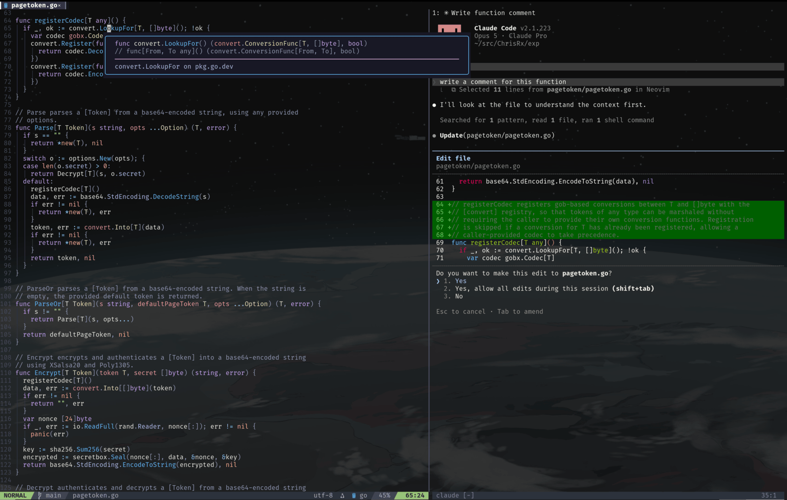

# nixos-config

This repo is my personal NixOS configurations. It is based heavily on Frost-Phoenix's [Frost-Phoenix/nixos-config](https://github.com/Frost-Phoenix/nixos-config).

## Usage

Upgrade packages and rebuild OS (includes home-manager):

```shell
task upgrade
```

The output of `$(hostname)` is used to pass in which host should be built.

### Modules

```shell
├── 📁 hosts
│   └── 📁 <hostname>
│       ├── ⚙ default.nix
│       └── ⚙ hardware-configuration.nix
└── 📁 modules
    ├── 📁 home  # home-manager modules
    └── 📁 nixos # NixOS modules
```

Modules are separated by types into separate directories: `modules/nixos` and `modules/home` for NixOS and home-manager modules, respectively.

The core NixOS module contains basic configuration values with defaults and can be used by adding to imports:

```nix
imports = [ ../../modules/nixos/core ];
```

Using the GNOME desktop environment only requires importing the NixOS module:

```nix
imports = [ ../../modules/nixos/gnome ];
```

The following imports my entire home-manager configuration:

```nix
imports = [ inputs.home-manager.nixosModules.home-manager ];
home-manager = {
  users.${username} = {
    imports = [ ../../modules/home ];
  }
}
```

### neovim

<p align="center">
  
</p>

My neovim configuration using [nixvim](https://nix-community.github.io/nixvim/) is exposed as a flake output and can be used on any machine, with or without NixOS.

Run it without installing anything:

```shell
nix run github:ChrisRx/nixos-config#neovim
```

Add the flake as an input to use it as a module:

```nix
inputs.neovim.url = "github:ChrisRx/nixos-config";
```

As a home-manager module (works standalone or under NixOS):

```nix
imports = [ inputs.neovim.homeModules.neovim ];
```

As a NixOS module, installing it system-wide instead of per-user:

```nix
imports = [ inputs.neovim.nixosModules.neovim ];
```

Either module exposes the full `programs.nixvim` option tree, so anything can be overridden. Every plugin is enabled with `mkDefault`, so turning one off needs nothing special:

```nix
programs.nixvim = {
  plugins.treesitter.enable = false;
  plugins.lsp.servers.gopls.enable = false;
};
```

Everything else is still defined normally and needs `mkForce` to change:

```nix
programs.nixvim.opts.shiftwidth = lib.mkForce 4;
```

Plugin `settings` blocks are freeform and merge per key, so adding one is just:

```nix
programs.nixvim.plugins.gitsigns.settings.signs.add.text = "+";
```

Or just install the package directly, which takes no options:

```nix
environment.systemPackages = [ inputs.neovim.packages.${pkgs.stdenv.hostPlatform.system}.neovim ];
```

A few things to note:

* `nixpkgs.config.allowUnfree` must be set, since one plugin (`cmp-emoji`) is marked unfree.
* Both modules default to `wrapRc = true`, keeping the config sealed in the wrapper rather than writing `~/.config/nvim`. Set `programs.nixvim.wrapRc = false` to manage it as real files.
* Importing both modules on one host is redundant; pick whichever layer should own the editor.
* Supported on `x86_64-linux` and `aarch64-darwin`. `x86_64-darwin` does not work, as nixpkgs-unstable has dropped it.

## TODO

* More configuration options for NixOS/home-manager
* Add override for hostname in Taskfile.yml
* Better packages options for different sets of home-manager packages
* neovim configuration is still a WIP
  * treesitter grammars are not installing correctly and I need to still run `TSInstall` for some reason (might be good now?)
  * some small graphical quirks (spacing on bars)
  * finish Go snippets
* hyprland module is a placeholder and needs a lot of work
